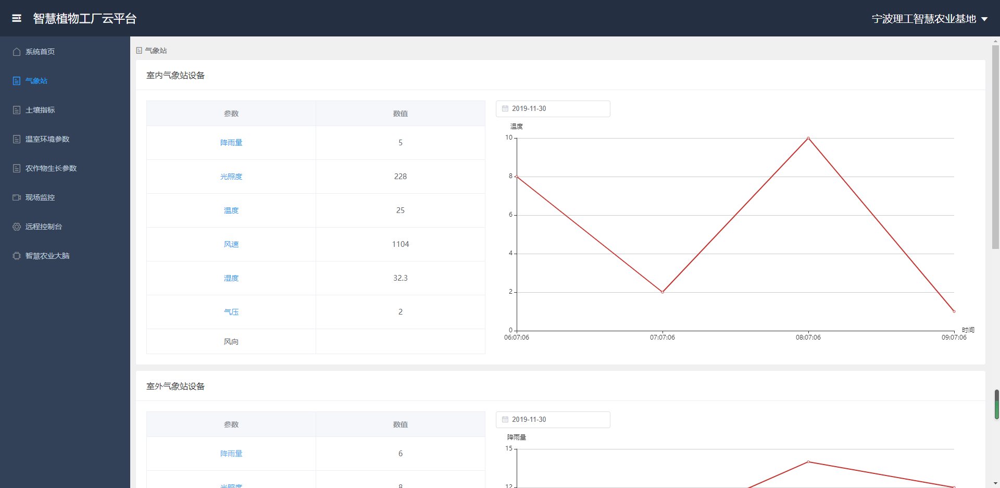

已完成气象站、土壤指标、监控部分，登录、修改名称、退出登录、左侧栏隐藏功能，地图修改为显示账号坐标和名称，并且本账号和其他用户账号区分开。

首页

气象站页面

监控页面

# my-app

## Project setup
```
npm install
```

### Compiles and hot-reloads for development
```
npm run serve
```

### Compiles and minifies for production
```
npm run build
```

### Customize configuration
See [Configuration Reference](https://cli.vuejs.org/config/).
